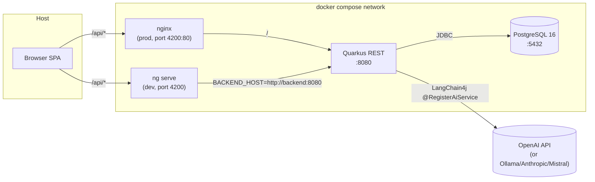
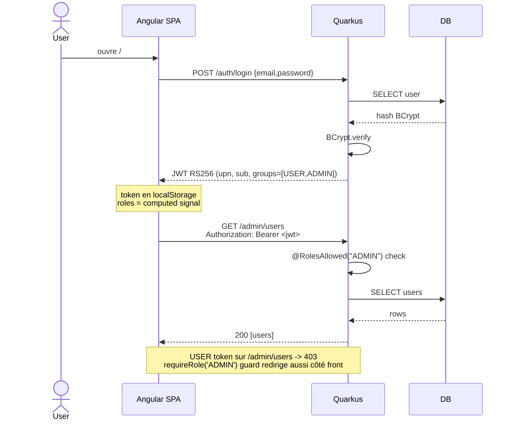
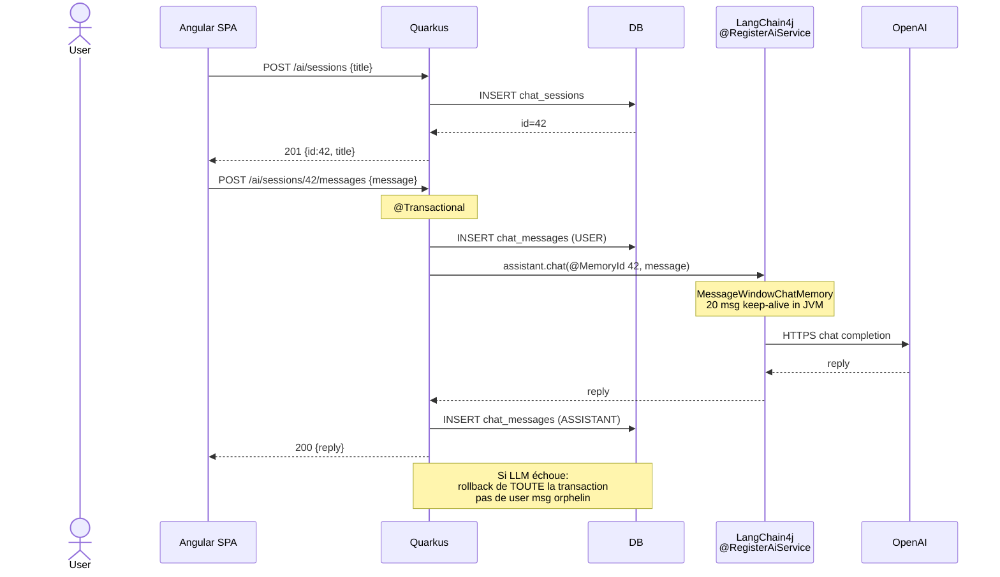

# starter — Quarkus + Angular + LangChain4j

> ## 🚀 Live demo
>
> **URL:** **https://charity-day-frontend.onrender.com**
>
> Hébergé sur Render (tier gratuit). Le backend s'endort après 15 min
> d'inactivité, donc la première page peut mettre ~30 s à répondre — c'est
> normal, ensuite tout est fluide.
>
> **Comptes de démo:**
>
> | Email          | Mot de passe | Rôles            |
> | -------------- | ------------ | ---------------- |
> | `admin@local`  | `admin`      | `ADMIN`, `USER`  |
> | `user@local`   | `user`       | `USER`           |
>
> Ou créez un compte via le bouton **Créer un compte** sur l'écran de login.
> Toggle **FR / EN** en haut à droite. Voir [DEPLOY.md](DEPLOY.md) pour
> redéployer ou rolling back.

Kit de démarrage hackathon : backend Java 17 / Quarkus 3.28, frontend
Angular 20 standalone, auth JWT avec RBAC, assistant IA persistant via
LangChain4j, CRUD de démo, le tout orchestré par docker compose avec
hot-reload back + front.

> Pas de SSO / OIDC / Keycloak. Pas de NgRx. Pas de YAML. Pas de wiring
> HTTP manuel vers le LLM. Tout passe par les extensions Quarkus
> officielles et `@RegisterAiService`.

## Stack

| Couche       | Outils                                                     |
| ------------ | ---------------------------------------------------------- |
| Backend      | Quarkus 3.28.4 / Java 17, RESTEasy Reactive                |
| Persistence  | Hibernate ORM + Panache + Flyway / PostgreSQL 16           |
| Auth         | smallrye-jwt (RS256) + BCrypt (at.favre)                   |
| LLM          | quarkus-langchain4j-openai (interchangeable)               |
| Frontend     | Angular 20 standalone + signals + PrimeNG 20 (Aura)        |
| Tests        | JUnit 5 / AssertJ / Testcontainers (backend), Karma (front)|
| Infra        | docker compose (prod-like + override dev bind-mounts)      |

## Architecture



## Flow d'authentification + RBAC



## Flow chat IA persistant



## Démarrage rapide

```bash
# Cycle dev (hot reload back + front, première run ~5 min pour
# télécharger Maven + npm deps dans les volumes nommés)
docker compose -f infra/docker-compose.yml -f infra/docker-compose.dev.yml up

# Prod-like (rebuild images)
docker compose -f infra/docker-compose.yml up -d --build

# Arrêt + suppression des volumes (perd la DB)
docker compose -f infra/docker-compose.yml down -v
```

| Service  | URL                       | Notes                                |
| -------- | ------------------------- | ------------------------------------ |
| Frontend | http://localhost:4200     | nginx en prod, ng serve en dev       |
| Backend  | http://localhost:8080     | `/q/dev/` Dev UI en mode dev         |
| Postgres | localhost:5432            | user=`inetum` pass=`inetum`          |

### Users seedés (profil dev uniquement)

| Email          | Mot de passe | Rôles            |
| -------------- | ------------ | ---------------- |
| admin@local    | admin        | `ADMIN`, `USER`  |
| user@local     | user         | `USER`           |

### Activer l'IA

Renseigne ta clé dans `infra/.env` (ignoré par git) :

```ini
OPENAI_API_KEY=sk-...
OPENAI_CHAT_MODEL=gpt-4o-mini
```

Sans clé, `POST /ai/sessions/{id}/messages` renvoie 500 (la transaction
rollback proprement, pas de message orphelin en DB).

## Features incluses

- Auth JWT (RS256, clés RSA générées au scaffold, hors git)
- BCrypt password hashing + verify, BootstrapService seede les users dev
- RBAC double-côté : `@RolesAllowed` (serveur) + `requireRole` CanActivateFn (client)
- Routes Angular protégées par `authGuard` + role guard
- HTTP interceptor : ajoute `Authorization: Bearer <jwt>`, force logout sur 401
- CRUD Notes (titre + contenu) **scoped par utilisateur** via `jwt.getSubject()`
- Chat IA avec **sessions persistées** (chat_sessions + chat_messages)
  et mémoire conversationnelle par session via `@MemoryId`
- Layout top nav (Notes par défaut, lien Admin conditionnel au rôle)
- `/api` unifié dev (proxy `ng serve` via `BACKEND_HOST`) et prod (nginx)
- ExceptionHandler centralisé `ExceptionMapper<Throwable>` avec body
  `{status, code, message}` (pas de stack trace leakée au client)
- Pas de logging des prompts, completions, mots de passe ou API keys

## Layout du repo

```
starter/
├── backend/                              Quarkus 3.28 / com.inetum.starter
│   ├── pom.xml
│   ├── src/main/java/com/inetum/starter/
│   │   ├── auth/                         LoginResource, JwtService, PasswordHasher
│   │   ├── admin/                        AdminResource (@RolesAllowed("ADMIN"))
│   │   ├── notes/                        NoteResource (owner-scoped CRUD)
│   │   ├── service/                      UserService, NoteService
│   │   ├── service/ai/                   AiAssistant, ChatSessionService, AiResource
│   │   ├── entity/                       UserEntity, NoteEntity, ChatSession+Message
│   │   ├── repository/                   PanacheRepository implementations
│   │   ├── dto/{request,response,mapper}/ MapStruct mappers (jakarta-cdi)
│   │   ├── api/rest/exception/           ExceptionHandler
│   │   ├── exception/                    AppException + concretes
│   │   └── config/                       BootstrapService, ChatMemoryConfig
│   ├── src/main/resources/
│   │   ├── application.properties        (un seul fichier, profils %dev./%test./%prod.)
│   │   ├── privateKey.pem / publicKey.pem  (générées, gitignored)
│   │   └── db/migration/                 V1__init.sql, V2__notes.sql, V3__chat.sql
│   └── src/main/docker/Dockerfile        (multistage, BuildKit cache mount)
├── frontend/                             Angular 20 standalone
│   ├── package.json
│   ├── angular.json / proxy.conf.js
│   ├── nginx.conf / Dockerfile           (prod multistage)
│   └── src/app/
│       ├── core/                         auth.service, *.guard, http.interceptor, services
│       ├── layout/                       MainLayoutComponent (top nav)
│       └── features/                     login, chat (sidebar sessions), notes, admin
├── infra/
│   ├── docker-compose.yml                3 services (postgres, backend, frontend)
│   ├── docker-compose.dev.yml            override : bind-mounts + caches nommés
│   └── .env.example                      template pour la vraie .env (ignorée)
├── CLAUDE.md                             conventions repo
├── backend/CLAUDE.md                     style Java / Quarkus
└── frontend/CLAUDE.md                    style Angular / PrimeNG
```

## API

| Méthode                  | Path                            | Auth | Rôle requis  |
| ------------------------ | ------------------------------- | ---- | ------------ |
| POST                     | `/auth/login`                   | —    | —            |
| GET                      | `/admin/users`                  | JWT  | `ADMIN`      |
| GET, POST                | `/notes`                        | JWT  | USER, ADMIN  |
| GET, PUT, DELETE         | `/notes/{id}`                   | JWT  | USER, ADMIN  |
| GET, POST                | `/ai/sessions`                  | JWT  | USER, ADMIN  |
| DELETE                   | `/ai/sessions/{id}`             | JWT  | USER, ADMIN  |
| GET, POST                | `/ai/sessions/{id}/messages`    | JWT  | USER, ADMIN  |
| POST                     | `/ai/chat` (stateless)          | JWT  | USER, ADMIN  |
| GET                      | `/q/health/ready`, `/q/dev/`    | —    | —            |

## Changer de provider LLM

Le starter utilise `quarkus-langchain4j-openai`. Pour Ollama / Anthropic /
Mistral : remplacer l'extension dans `pom.xml`, ajuster les propriétés
`quarkus.langchain4j.<provider>.*` dans `application.properties`. **L'interface
`AiAssistant` ne change pas** (c'est tout l'intérêt de `@RegisterAiService`).

| Provider   | Extension Maven                                | Doc                                       |
| ---------- | ---------------------------------------------- | ----------------------------------------- |
| OpenAI     | `quarkus-langchain4j-openai`                   | https://docs.quarkiverse.io/quarkus-langchain4j/dev/openai.html |
| Ollama     | `quarkus-langchain4j-ollama`                   | https://docs.quarkiverse.io/quarkus-langchain4j/dev/ollama.html |
| Anthropic  | `quarkus-langchain4j-anthropic`                | https://docs.quarkiverse.io/quarkus-langchain4j/dev/anthropic.html |
| Mistral    | `quarkus-langchain4j-mistral-ai`               | https://docs.quarkiverse.io/quarkus-langchain4j/dev/mistral-ai.html |

## Conventions

Détaillées dans :

- [CLAUDE.md](CLAUDE.md) — layout, compose, pièges, commits
- [backend/CLAUDE.md](backend/CLAUDE.md) — Quarkus, CDI, JWT, LangChain4j, what not to do
- [frontend/CLAUDE.md](frontend/CLAUDE.md) — Angular 20, PrimeNG, signals, RBAC

Règles fortes :

- CDI only (`@ApplicationScoped` / `@Inject`), jamais Spring, jamais `javax.*`
- Injection par constructeur (Lombok `@RequiredArgsConstructor`)
- DTO suffixe `DTO`, entités suffixe `Entity`, resources `Resource`, etc.
- Logging via `org.jboss.logging.Logger`, jamais de prompt / token / API key loggué
- Flyway append-only, jamais modifier une migration appliquée
- Angular standalone uniquement, signals pour l'état, PrimeNG `pi-*` seulement
- Pas de `Co-Authored-By:` dans les messages de commit

## Licence

Aucune licence appliquée pour l'instant (private repo). À ajouter avant
toute mise en open source.
